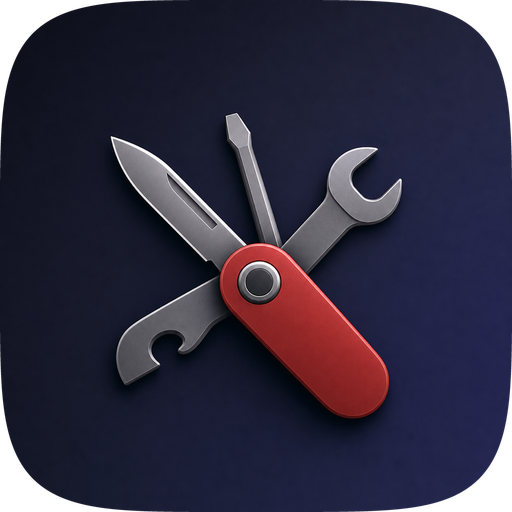
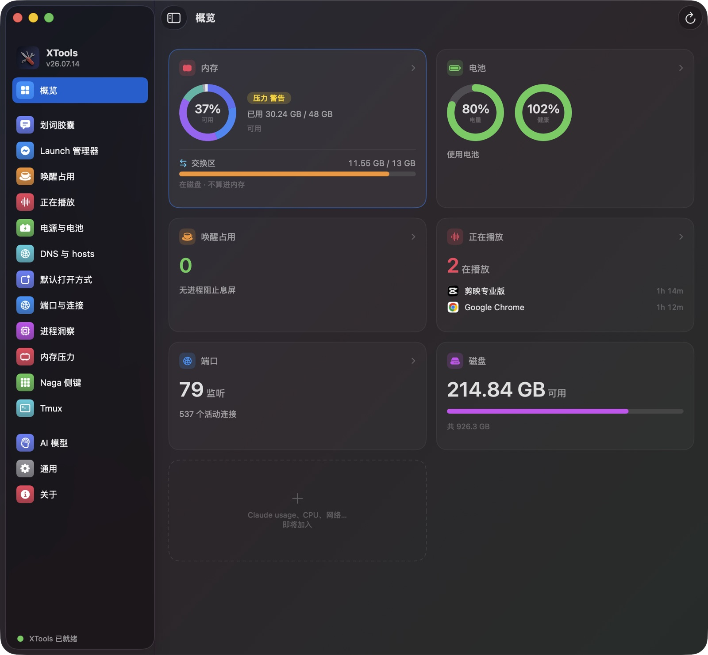
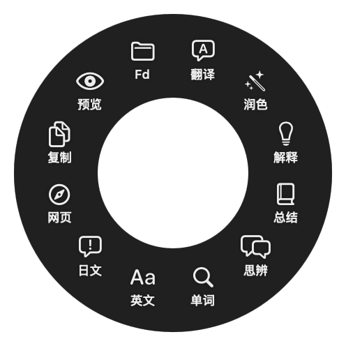
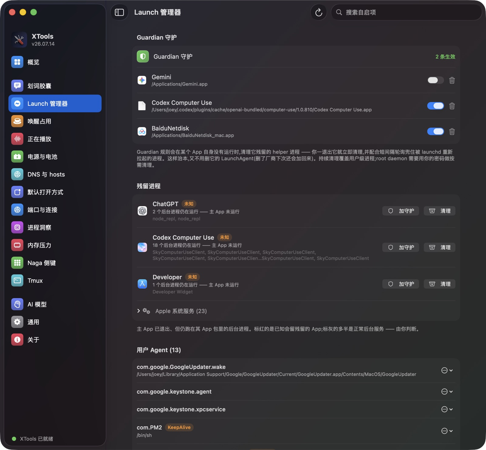
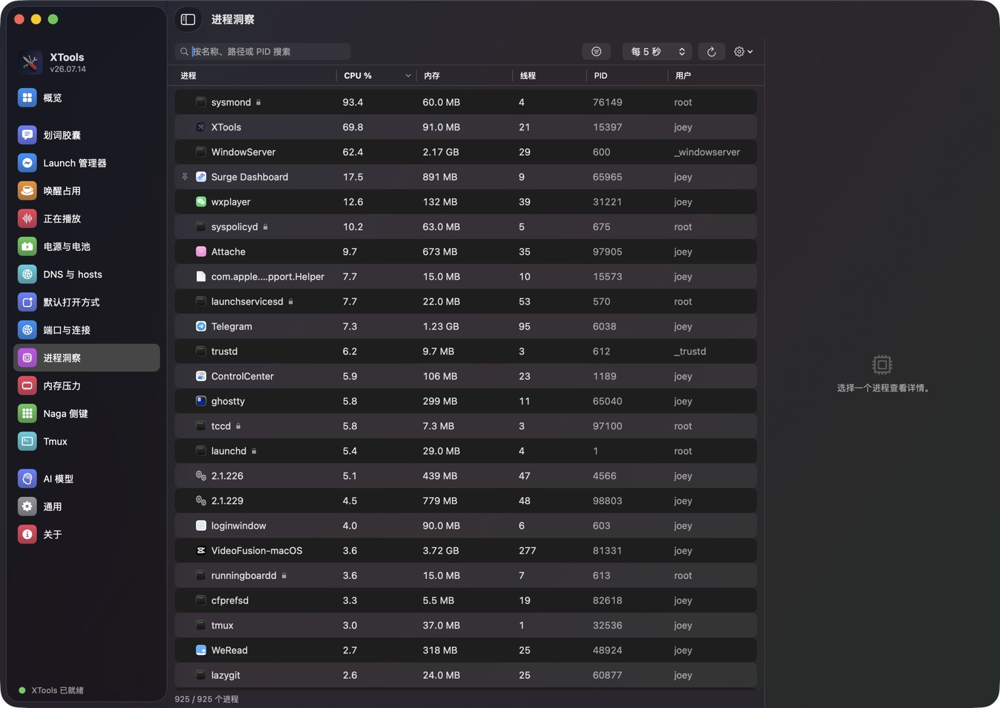
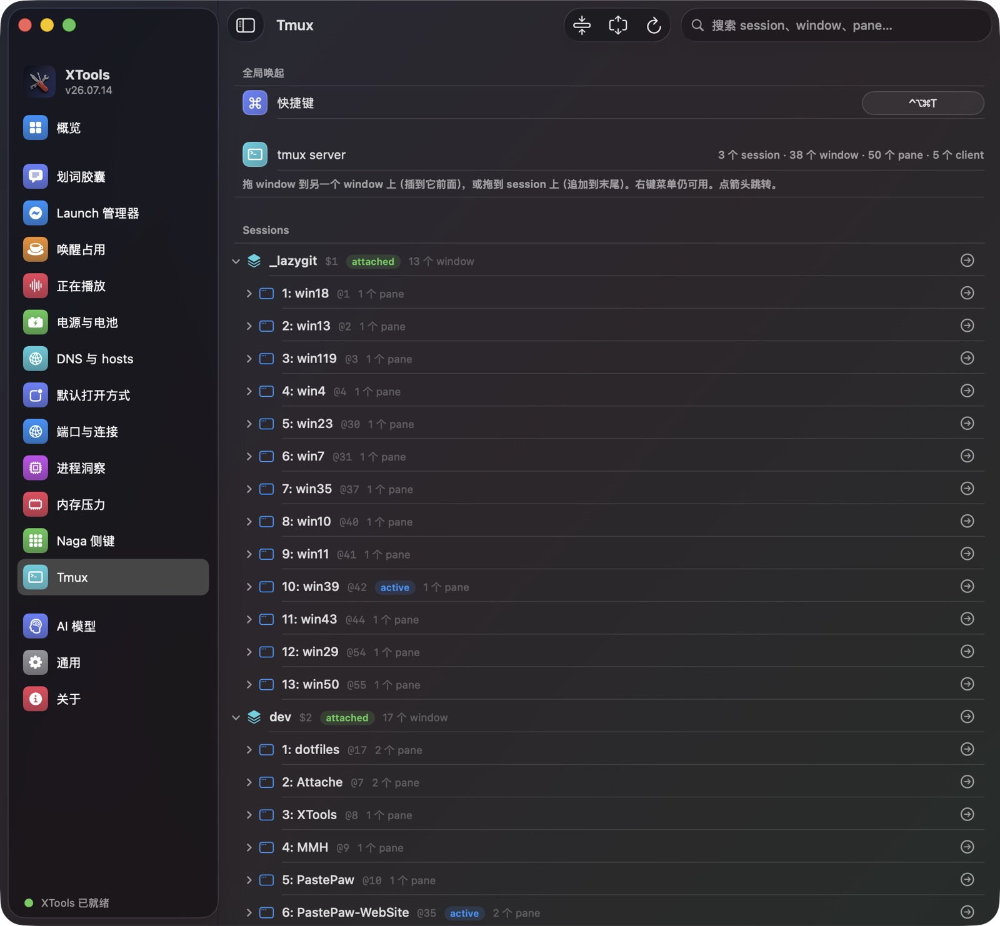

<h1 align="center">
  <br/>
  XTools
</h1>

<p align="center">
  <b>一个 macOS app，装下十几件平时要开终端才能干的小事——<br/>
  退不干净的后台进程、不让电脑睡觉的程序、被占用的端口、tmux 会话，外加一个划词就弹出来的 AI 胶囊。</b>
</p>

<p align="center">
  <b>🇨🇳 中文</b> •
  <a href="README_EN.md">🇺🇸 English</a>
</p>

<p align="center">
  <a href="https://github.com/XueshiQiao/XTools/actions/workflows/build.yml"></a>
  <a href="https://github.com/XueshiQiao/XTools/releases/latest"></a>
  
  
  <a href="https://github.com/XueshiQiao/XTools/stargazers"></a>
</p>

<p align="center">
  ⭐ <b>如果 XTools 帮你省下了开终端的功夫，欢迎给个 <a href="https://github.com/XueshiQiao/XTools">Star</a></b> —— 能帮更多人发现它。
  <br/>
  ✨ <a href="https://xueshi.dev">我做的更多应用 → xueshi.dev</a>
</p>

XTools 是一个**工具箱**：一个原生窗口，一个标签页一个工具。每个工具只回答一件关于这台
Mac 的烦心事——*我明明退出了那个 app，怎么还有进程在跑？谁在不让屏幕休眠？3000 端口被谁
占了？`sysmond` 到底是个什么东西？* 每个工具各自独立成一个文件夹，所以工具越加越多，
app 也不会变成一锅粥。



## 为什么做 XTools？

这里面每个工具，替代的都是你本来要手敲的东西：`lsof -i -P`、`pmset -g assertions`、
`launchctl list`、`scutil --dns`、`tmux list-sessions`，或者一个问题装一个 5 MB 的小应用。
这些事都不难，只是**烦**——而且命令打印出来的答案，还得再动一次手才能真正解决问题。

所以 XTools 做了两件命令行做不到的事：

- **答案和按钮在同一个地方。** 那个不让电脑睡觉的进程，旁边就是「退出」；那个指向已删除
  app 的 plist，旁边就是「停用」。
- **绝不为了消掉一个症状去毁掉你的东西。** 停用一个 LaunchAgent 是把 plist 改名成
  `.bak`，从不删除；除非你自己打开了对应的规则，否则不会自动杀任何进程。

## ✨ 有哪些工具

所有设置都在 app 里点，不需要手写任何配置文件。

| 工具 | 它回答什么 |
|---|---|
| **概览** | 内存、电池、唤醒占用、音频、端口、磁盘，一眼看完 |
| **划词胶囊** | 在任何地方选中文字 → 光标处弹出一圈 AI 动作 |
| **正在播放** | 现在到底是哪个 app 在出声？ |
| **唤醒占用** | 谁在不让我的 Mac（或者屏幕）睡觉？ |
| **电源与电池** | 电池还健康吗？我的休眠设置是怎样的？ |
| **DNS 与 hosts** | 我现在用的是哪个 DNS？`/etc/hosts` 里写了什么？ |
| **默认打开方式** | `.md`、`.json`、`http://` 现在归哪个 app 打开？ |
| **端口与连接** | 3000 端口被谁占了？这台 Mac 正连着哪些地方？ |
| **进程洞察** | 这个进程到底是干什么的？用人话说 |
| **内存压力** | 我的 Mac 是真的内存不够，还是只是看着忙？ |
| **Launch 管理器** | app 退出后还有什么在跑？我的 LaunchAgents 里都装了些什么？ |
| **Tmux** | 不用敲 `tmux` 就能看见并跳转我的会话 |
| **Naga 侧键** | 把雷蛇 Naga 的侧键变成我自己定的快捷键 |
| **ROG 键盘** | 让 ROG Falcata 一插上 Mac 就回到 Mac 的配置 |

### 💬 划词胶囊 —— 选中文字，动作就弹出来



在**任何** app 里选中一段文字，光标处就会弹出一个小面板，上面是你自己配的动作。默认自带
三个 AI 动作——翻译、润色、解释——你可以随便加：每个动作就是一个名字、一个图标、一段你自己
写的 prompt，还可以单独指定用哪个模型。

- **三种样式** —— 选区上方的横向**胶囊**，或者以光标为中心的**圆环** / **液态**样式（右图）。
- **流式输出**，边生成边按 Markdown 渲染，结果面板会自动长高到刚好装下。
- **网页预览** —— 选中的内容带链接就用内置的迷你浏览器打开；不带链接就直接拿这段文字去搜。
- **截图取字（OCR）** —— 按一下快捷键，在屏幕上框一块区域，里面的文字会被识别出来，交给同一批
  动作处理。图片、视频画面、以及那些根本不让你选中文字的 app，都能取。
- 模型自己接：**OpenAI**、**DeepSeek**、**豆包（Ark）**、**通义千问（DashScope）**，或者本地的
  **Ollama**。API key 存在 **Keychain** 里，不落配置文件。

<br clear="right"/>

### ⚡ Launch 管理器 —— app 退了，它的小弟没退



有些 app 退出之后，会留下一堆后台进程继续跑（最经典的就是百度网盘的 `netdisk_service`）。
Launch 管理器的做法是：把每个正在运行的进程归到它所属的 `.app` 里，然后把那些「主 app 已经
不在了、小弟还在跑」的 app 挑出来给你看。

- **残留进程** —— 惯犯会高亮；Apple 的系统服务和常见的更新器会置灰，永远不会被建议清理。
  一键**清理**。
- **Guardian 规则** —— 按 app 单独开启：只要这个 app 没在运行，XTools 就替你清掉它的残留，
  你一退出立刻清一次，再加一个短周期的轮询，接住那些被 launchd 重新拉起来的。它**故意不去动**
  这个 app 的 LaunchAgent——所以哪怕厂商下次启动又把 LaunchAgent 加回来，规则照样有效。
- **LaunchAgents / Daemons** —— 三个 launchd 目录（含 root 的）合成一张列表。一眼看出哪些
  还指着你早就删掉的 app，然后停止或停用它们。停用是**把 plist 改名成 `.bak`**，绝不删除。

用户级的清理不需要任何权限。root 级的守护进程走「用的时候弹一次密码」的路径；XTools **不会**
在你系统里装一个常驻的提权 helper。

### 🔎 进程洞察 —— 这玩意儿到底是干嘛的



看起来像活动监视器的进程列表，但重点不是这张表，而是这张表回答不了的那个问题。选中一个进程，
模型会用大白话讲清楚它是什么——而且是基于 XTools 先在本地查到的事实来讲的：**代码签名**
（到底是谁签的）、**是哪个 LaunchAgent / Daemon 把它拉起来的**、真实路径和启动参数。这一步很
关键，因为进程自报的名字，恰恰是恶意程序唯一能随便改的东西。

### 🧵 Tmux —— 不用敲 `tmux` 也能管会话



会话 → 窗口 → 窗格的实时树状图。点箭头直接跳过去，**把一个窗口拖到另一个会话上**就能搬过去，
还能全局搜索。默认按 `⌃⌥⌘T` 可以在任何地方把这棵树叫出来变成一个浮动面板，不用先去找终端。

### 🔋 只看不动的那几个

下面这四个只负责把真实情况告诉你，然后就不打扰你了：

- **唤醒占用** —— 哪些进程持有 power assertion（系统里那种「请别睡」的声明），让屏幕或整台
  Mac 睡不着，可以直接退掉肇事者。
- **正在播放** —— 现在哪些 app 占着音频输出，各占了多久。
- **电源与电池** —— 电池健康度和循环次数、当前生效的 `pmset` 休眠设置、最近的睡眠/唤醒记录。
- **内存压力** —— 内核真正在用的那个内存压力信号（绿/黄/红），旁边配上活动监视器的那几个
  数字：可用、活跃、非活跃、联动（Wired）、已压缩、可清除、交换区——每一项都用一句话说明白
  它是什么意思。

### 🌐 网络与系统

- **端口与连接** —— 每一个监听端口，以及它背后是哪个进程（「3000 端口被谁占了」），外加实时
  连接列表和一个结束进程的按钮。是我那个
  [netstat-cat](https://github.com/XueshiQiao/netstat-cat) 的原生 Swift 版。
- **DNS 与 hosts** —— 当前真正生效的 DNS 服务器和搜索域，一键清 DNS 缓存，以及一个
  `/etc/hosts` 编辑器（保存前先备份原文件）。
- **默认打开方式** —— 改某个文件类型或者 URL scheme 归哪个 app 打开，覆盖了一批常用类型。
  全部在用户级完成，不需要 `sudo`。

### 🖱️ 外设

- **Naga 侧键** —— 雷蛇 Naga V2 Pro 的数字侧键，发出来的其实是普通的键盘按键，所以 macOS
  自己没法重映射。XTools 会认出「这一下是从那个设备来的」，把它吞掉，然后发出你录制的那个
  快捷键。
- **ROG 键盘** —— 华硕 ROG Falcata 同时连着两台电脑（USB-C 接这台 Mac，2.4 GHz 接收器插在
  PC 上），但它的配置并不跟着机身上那个切换开关走，于是 Mac 的键位会被带去 Windows。这个工具
  会自动把正确的配置切回来。

> ROG 键盘目前在 `main` 分支上，下个版本发布；上面其他工具在当前版本里都已经有了。

## 安装

从 **[GitHub Releases](https://github.com/XueshiQiao/XTools/releases)** 下载最新的 `.dmg`，
打开后把 XTools 拖进「应用程序」文件夹。

应用已使用 Apple 开发者证书签名，并通过了 Apple 公证（Notarization），可以直接安装，不会出现
安全警告。后续更新通过 [Sparkle](https://sparkle-project.org) 自动完成。

需要 **macOS 13** 或更高版本，Apple 芯片和 Intel 都支持。

### 权限

只有当你打开某个需要权限的功能时，XTools 才会去要那个权限——启动 app 本身一个都不需要。

| 权限 | 谁需要 | 用来干什么 |
|---|---|---|
| **辅助功能（Accessibility）** | 划词胶囊、Naga 侧键 | 读取你选中的文字；看到要重映射的按键 |
| **屏幕录制（Screen Recording）** | 划词胶囊 → 截图取字 | 读取屏幕像素，才能对它做 OCR |
| **输入监控（Input Monitoring）** | Naga 侧键 | 把 Naga 发的按键和你键盘发的区分开 |
| **管理员密码** | Launch 管理器、DNS | 用到的时候弹一次，用于 root 守护进程和 `/etc/hosts` |

XTools **没有开沙盒**——枚举其他进程、读取 launchd 的 plist 正是它的本职工作，而沙盒把这两件
事都禁掉了。

### 隐私

- **只有划词胶囊和进程洞察会往外发东西**，而且只发你选中的那段文字、或者你点的那个进程，
  发给你自己配置的那个模型服务商。接一个本地 Ollama，就什么都不会离开这台电脑。
- API key 存在 **macOS Keychain** 里。
- OCR 完全在本机跑（Apple 的 Vision 框架），截下来的图不会写进磁盘。
- 匿名使用统计可以在「关于」页里关掉。而且当前版本压根没配置统计服务，所以现在什么都没在发。

## 技术栈

- **原生 macOS** —— AppKit 做外壳（菜单栏、窗口控制器）；每个页面都是 SwiftUI，通过
  `NSHostingController` 承载。Swift 5.9，macOS 13+。
- [XcodeGen](https://github.com/yonaskolb/XcodeGen) —— `project.yml` 是 Xcode 工程配置的
  唯一来源。
- [Sparkle](https://sparkle-project.org) 实现自动更新（appcast 用 EdDSA 签名）。
- 英文 / 简体中文，在 app 内切换，不用重启。

## 从源码构建

### 前置要求

- macOS 13+
- Xcode 16+
- [XcodeGen](https://github.com/yonaskolb/XcodeGen)（`brew install xcodegen`）

### 步骤

```bash
git clone https://github.com/XueshiQiao/XTools.git
cd XTools
brew install xcodegen
xcodegen generate

scripts/run.sh                    # 杀掉旧的 → 构建 Debug → 重新启动
scripts/run.sh --tab now-playing  # 顺便直接打开某个工具页
# 或者：open XTools.xcodeproj，然后 Cmd+R
```

Debug 版会作为 `XTools-Debug.app`（bundle id `me.xueshi.xtools.debug`）和正式版并存。
日志在 `~/Library/Logs/XTools/XTools.log`。

### 加一个新工具

外壳里没有任何写死的工具——侧边栏、路由、生命周期全部由一个注册表驱动，所以加一个工具只有
三步：

1. 新建 `XTools/Sources/Tools/<Name>/`。
2. 在 `<Name>Tool` 类上实现 `XToolModule`：`id`、`title`、`symbol`、`color`、
   `makeRootView()`；如果它需要在 app 存活期间一直跑，再实现可选的 `activate()` /
   `shutdown()`。
3. 往 `ToolRegistry.makeAllTools()` 里加一行。

一个工具自己的 model、service、store、view 和持久化全都待在它那一个文件夹里；`Core/` 和
`UI/` 只放共享的基础设施。架构见 [`CLAUDE.md`](CLAUDE.md)，设计取舍和范围见
[`docs/DESIGN.md`](docs/DESIGN.md)。

---

作者 [@XueshiQiao](https://x.com/XueshiQiao) · [xueshi.dev](https://xueshi.dev) ·
姊妹应用 [AnyDrag](https://github.com/XueshiQiao/AnyDrag)
