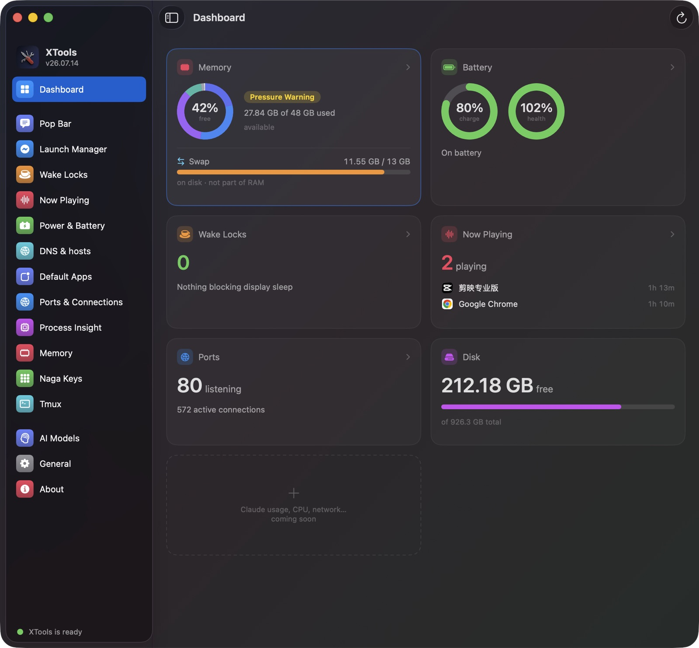
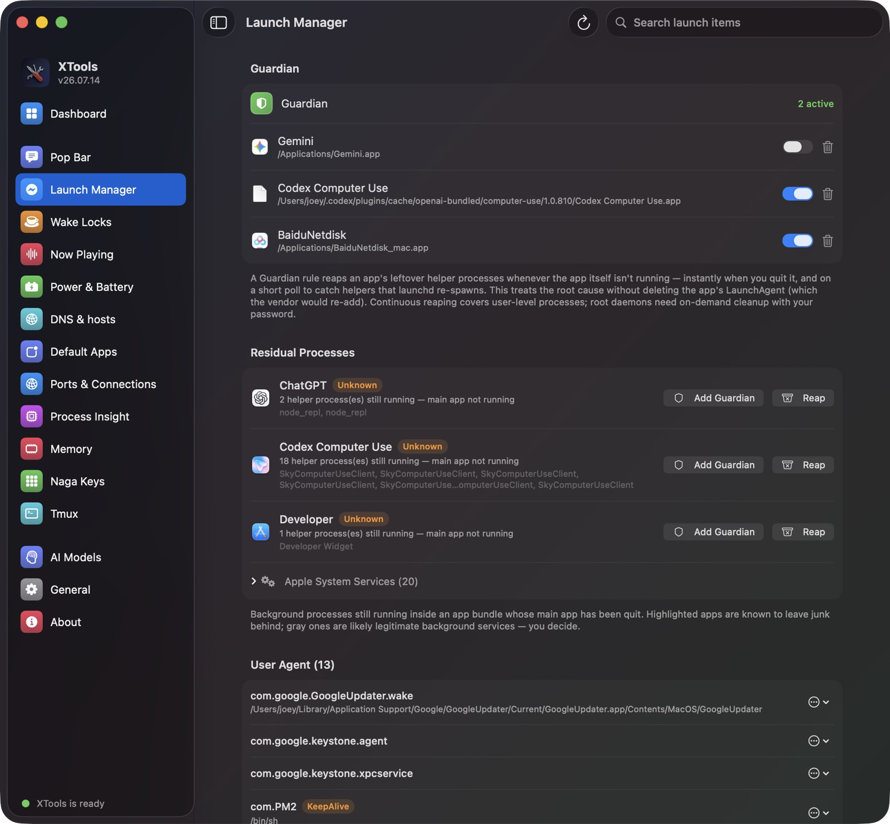
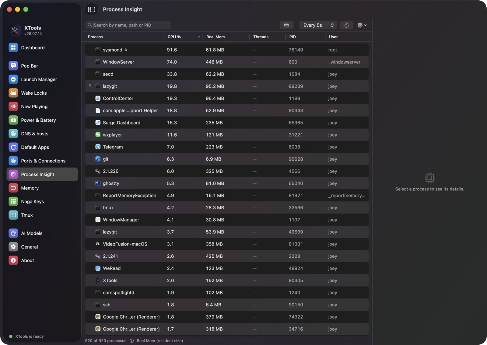
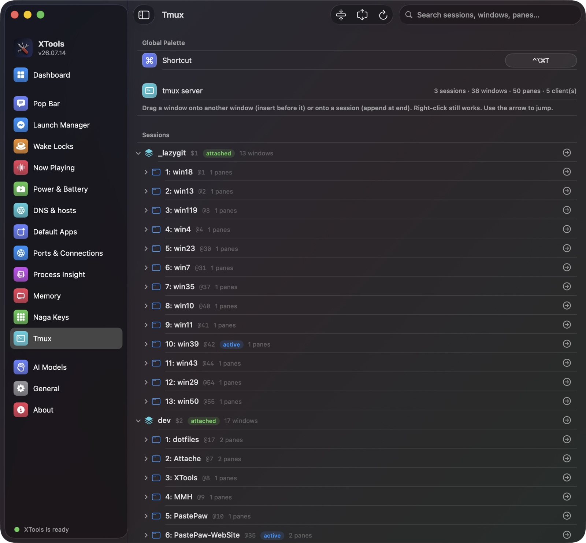

<h1 align="center">
  <br/>
  XTools
</h1>

<p align="center">
  <b>One macOS app for the dozen small things you normally open Terminal for —<br/>
  ghost processes, wake locks, listening ports, tmux sessions — plus an AI popup on any text you select.</b>
</p>

<p align="center">
  <a href="README.md">🇨🇳 中文</a> •
  <b>🇺🇸 English</b>
</p>

<p align="center">
  <a href="https://github.com/XueshiQiao/XTools/actions/workflows/build.yml"></a>
  <a href="https://github.com/XueshiQiao/XTools/releases/latest"></a>
  
  
  <a href="https://github.com/XueshiQiao/XTools/stargazers"></a>
</p>

<p align="center">
  ⭐ <b>If XTools saves you a trip to Terminal, please <a href="https://github.com/XueshiQiao/XTools">star the repo</a></b> — it helps others find it.
  <br/>
  ✨ <a href="https://xueshi.dev">More apps I made → xueshi.dev</a>
</p>

XTools is a **toolbox**: one native window, one tool per tab. Each tool answers a single
annoying question about your Mac — *what is still running after I quit that app? what is
keeping the screen awake? who is sitting on port 3000? what actually is `sysmond`?* — and
each one lives in its own folder, so the collection can keep growing without the app
turning into a swamp.



## Why XTools?

Every tool in here replaces something you'd otherwise do by hand: `lsof -i -P`,
`pmset -g assertions`, `launchctl list`, `scutil --dns`, `tmux list-sessions`, or a
single-purpose 5 MB app per problem. None of those is hard — they're just *annoying*,
and the answers they print need a second step to be useful.

So XTools does two things a shell command can't:

- **It shows you the answer and the button in the same place.** The process that's
  blocking sleep has a *Quit* next to it. The plist pointing at a deleted app has a
  *Disable* next to it.
- **It never destroys anything to make a symptom go away.** A LaunchAgent plist is
  renamed to `.bak`, never deleted. Nothing is killed automatically unless you switched
  on a rule that says so.

## ✨ The tools

Everything is configured in the app — there are no config files to hand-edit.

| Tool | What it answers |
|---|---|
| **Dashboard** | Memory, battery, wake locks, audio, ports and disk at a glance |
| **Pop Bar** | Select text anywhere → a popup of AI actions at the cursor |
| **Now Playing** | Which apps are actually playing audio right now? |
| **Wake Locks** | What is keeping my Mac (or its display) awake? |
| **Power & Battery** | How healthy is my battery, and what are my sleep settings? |
| **DNS & hosts** | Which resolvers am I using, and what's in `/etc/hosts`? |
| **Default Apps** | Which app opens `.md`, `.json`, `http://`…? |
| **Ports & Connections** | Who is on port 3000? What is this Mac connected to? |
| **Process Insight** | What *is* this process — in plain language? |
| **Memory** | Is my Mac actually short on RAM, or does it just look busy? |
| **Launch Manager** | What's still running after I quit that app? What's in my LaunchAgents? |
| **Tmux** | See and jump around my tmux sessions without typing `tmux` |
| **Naga Keys** | Turn the Razer Naga's side buttons into shortcuts I choose |
| **ROG Keyboard** | Keep an ASUS ROG Falcata on its Mac profile |

### 💬 Pop Bar — select text, get a popup


Select text in **any** app and a small popup appears at the cursor with your own actions
on it. Three built-in AI actions ship by default — Translate, Polish, Explain — and you
can add as many as you like: each action is a title, an icon, and a prompt you write
yourself, with its own model if you want one.

- **Three looks** — a horizontal **capsule** above the selection, or a **wheel** / **liquid**
  ring centred on the cursor. The ring pictured is my own set of actions, in my own
  language — that's the point of it.
- **Streaming results** rendered as live Markdown, in a panel that grows to fit.
- **Web Preview** — if the selection carries a link, open it in a built-in mini browser;
  if it doesn't, search the web for the selected text instead.
- **Screenshot Text (OCR)** — press a shortcut, drag a box over anything on screen, and
  its text is recognized and handed to the same actions. Works on images, video frames,
  and apps that won't let you select text.
- Bring your own model: **OpenAI**, **DeepSeek**, **Doubao (Ark)**, **Qwen (DashScope)**,
  or a local **Ollama**. API keys live in your **Keychain**, never in a config file.

<br clear="right"/>

### ⚡ Launch Manager — the app quit, its helpers didn't



Some apps leave background helpers running long after you quit them (the classic case is
Baidu Netdisk's `netdisk_service`). Launch Manager finds them by grouping every running
process under the `.app` bundle it came from, then showing you the bundles whose main app
isn't running.

- **Residual processes** — repeat offenders are highlighted; Apple system services and
  known updaters are greyed out and never suggested for cleanup. One click to **Reap**.
- **Guardian rules** — opt in per app: whenever that app isn't running, XTools reaps its
  leftovers for you, immediately when you quit it plus a short poll to catch the ones
  launchd re-spawns. It deliberately leaves the app's LaunchAgent alone, so it keeps
  working even after the vendor re-adds it.
- **LaunchAgents & Daemons** — all three launchd directories in one list, including root
  ones. Spot the entries pointing at apps you deleted, and stop or disable them. Disabling
  **renames the plist to `.bak`** — nothing is ever deleted.

User-level cleanup needs no privileges. Root daemons are handled on demand behind one
admin password prompt; XTools does **not** install a background privileged helper.

### 🔎 Process Insight — what *is* this thing?



An Activity-Monitor-style list, except the point isn't the list — it's the question the
list can't answer. Pick a process and a model explains it in plain language, grounded in
facts XTools gathers locally first: the **code signature** (who really signed it), the
**LaunchAgent or Daemon that started it**, its real path and arguments. That grounding
matters, because a process's own name is the one thing malware gets to choose.

### 🧵 Tmux — your sessions, without typing `tmux`



A live tree of sessions → windows → panes. Click the arrow to jump straight to one,
**drag a window onto another session** to move it there, and search across everything.
A global shortcut (`⌃⌥⌘T` by default) opens the same tree as a floating palette from
anywhere, so you never have to find a terminal first.

### 🔋 The read-only ones

These four just tell you the truth about your Mac and get out of the way:

- **Wake Locks** — the processes holding power assertions that keep the display or the
  whole Mac awake, with the option to quit the culprit.
- **Now Playing** — which apps currently hold an audio output, and for how long.
- **Power & Battery** — battery health and cycle count, your active `pmset` sleep
  settings, and recent sleep/wake events.
- **Memory** — the memory-pressure signal the kernel actually uses (green / yellow / red)
  next to Activity Monitor's numbers — Free, Active, Inactive, Wired, Compressed,
  Purgeable, swap — each with a sentence saying what it means.

### 🌐 Network & system

- **Ports & Connections** — every listening port with the process behind it ("who's on
  :3000"), plus live connections, and a kill button. A native Swift port of
  [netstat-cat](https://github.com/XueshiQiao/netstat-cat).
- **DNS & hosts** — the resolvers and search domains actually in use, a one-click DNS
  cache flush, and an editor for `/etc/hosts` that backs the file up before saving.
- **Default Apps** — change which app opens a file type or URL scheme, for a curated list
  of the common ones. All user-level, no `sudo`.

### 🖱️ Devices

- **Naga Keys** — the Razer Naga V2 Pro's numbered side buttons are sent as ordinary
  keystrokes, so macOS can't remap them. XTools recognizes the ones coming from that
  device specifically, swallows them, and emits the shortcut you recorded instead.
- **ROG Keyboard** — an ASUS ROG Falcata talks to two computers at once (USB-C here, a
  2.4 GHz receiver in a PC) and its profiles don't follow the switch on its body, so the
  Mac key map wanders off to Windows. This puts the right profile back automatically.

> ROG Keyboard is on `main` and ships in the next release; the tools above it are all in
> the current one.

## Install

Download the latest `.dmg` from **[GitHub Releases](https://github.com/XueshiQiao/XTools/releases)**
and drag XTools into your Applications folder.

The app is signed with an Apple Developer ID certificate and notarized by Apple, so it
installs without any security warnings. Updates arrive automatically through
[Sparkle](https://sparkle-project.org).

Requires **macOS 13** or later. Apple silicon and Intel.

### Permissions

XTools asks for a permission only when you turn on the feature that needs it — none of
them are required to launch the app.

| Permission | Needed by | Why |
|---|---|---|
| **Accessibility** | Pop Bar, Naga Keys | Read the selected text; see the key presses to remap |
| **Screen Recording** | Pop Bar → Screenshot Text | Read pixels from the screen to run OCR on them |
| **Input Monitoring** | Naga Keys | Tell the Naga's key presses apart from your keyboard's |
| **Admin password** | Launch Manager, DNS | One prompt, on demand, for root daemons and `/etc/hosts` |

XTools is **not sandboxed** — enumerating other processes and reading launchd plists is
the whole job, and the sandbox forbids both.

### Privacy

- **Pop Bar and Process Insight are the only tools that send anything anywhere**, and only
  the text you selected or the process you picked, to the model provider you configured.
  Point them at a local Ollama and nothing leaves the machine at all.
- API keys are stored in the **macOS Keychain**.
- OCR runs on-device (Apple's Vision framework). Screenshots are never written to disk.
- Anonymous usage stats can be switched off in **About**. No analytics backend is
  configured in the current build, so nothing is being sent today anyway.

## Tech Stack

- **Native macOS** — AppKit shell (menu bar, window controller); every page is SwiftUI
  hosted in an `NSHostingController`. Swift 5.9, macOS 13+.
- [XcodeGen](https://github.com/yonaskolb/XcodeGen) — `project.yml` is the single source of
  truth for the Xcode project.
- [Sparkle](https://sparkle-project.org) for auto-update (EdDSA-signed appcast).
- English / 简体中文, switchable in-app without a relaunch.

## Build from Source

### Prerequisites

- macOS 13+
- Xcode 16+
- [XcodeGen](https://github.com/yonaskolb/XcodeGen) (`brew install xcodegen`)

### Setup

```bash
git clone https://github.com/XueshiQiao/XTools.git
cd XTools
brew install xcodegen
xcodegen generate

scripts/run.sh                    # kill old → build Debug → relaunch
scripts/run.sh --tab now-playing  # …and open straight to one tool
# or: open XTools.xcodeproj  then Cmd+R
```

The Debug build installs alongside the release one as `XTools-Debug.app`
(bundle id `me.xueshi.xtools.debug`). Logs: `~/Library/Logs/XTools/XTools.log`.

### Adding a tool

The shell hard-codes nothing — the sidebar, routing and lifecycle are all driven by a
registry, so a new tool is three steps:

1. Create `XTools/Sources/Tools/<Name>/`.
2. Implement `XToolModule` on a `<Name>Tool` class — `id`, `title`, `symbol`, `color`,
   `makeRootView()`, plus optional `activate()` / `shutdown()` if it needs to run in the
   background for the life of the app.
3. Add one line to `ToolRegistry.makeAllTools()`.

A tool owns its own models, services, store, view and persistence inside that one folder.
`Core/` and `UI/` hold only shared infrastructure. See [`CLAUDE.md`](CLAUDE.md) for the
architecture and [`docs/DESIGN.md`](docs/DESIGN.md) for the decisions and scope.

---

By [@XueshiQiao](https://x.com/XueshiQiao) · [xueshi.dev](https://xueshi.dev) ·
sibling app [AnyDrag](https://github.com/XueshiQiao/AnyDrag)
